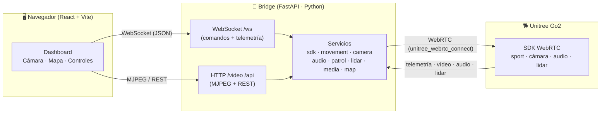
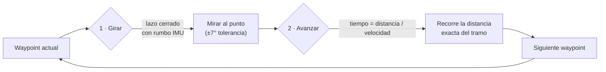

# 🐕 Panel de Control — Unitree Go2

**Dashboard web para teleoperar, vigilar y mapear un robot cuadrúpedo Unitree Go2 en tiempo real.**

Control manual, patrulla autónoma por waypoints, vídeo en vivo, foto/grabación, audio bidireccional (megáfono + escucha), mapa SLAM 2D y nube de puntos LiDAR 3D — todo desde el navegador.


---

## 📑 Índice

1. [¿Qué hace?](#-qué-hace)
2. [Arquitectura](#-arquitectura)
3. [Stack tecnológico](#-stack-tecnológico)
4. [Estructura del proyecto](#-estructura-del-proyecto)
5. [Requisitos](#-requisitos)
6. [Instalación y arranque](#-instalación-y-arranque)
7. [Servicios del backend](#-servicios-del-backend)
8. [Componentes del frontend](#-componentes-del-frontend)
9. [Protocolo WebSocket](#-protocolo-websocket)
10. [API REST](#-api-rest)
11. [Cómo funciona la patrulla autónoma](#-cómo-funciona-la-patrulla-autónoma)
12. [Configuración y calibración](#-configuración-y-calibración)
13. [Resolución de problemas](#-resolución-de-problemas)

---

## 🎯 ¿Qué hace?

| Función | Descripción |
|---|---|
| 🎮 **Control manual** | Mueve el robot con **WASD / flechas** (adelante, atrás, giro y desplazamiento lateral con Q/E). **Shift = turbo**. Botones Stand Up / Stand Down / Stop. |
| 🎥 **Vídeo en vivo** | Stream **MJPEG** de la cámara del robot en el navegador, con opción de **pantalla completa** solo de la cámara. |
| 📷 **Foto y vídeo** | Captura fotos y graba vídeo del directo. Se **descargan automáticamente** al PC. |
| 🗺️ **Mapa SLAM 2D** | Vista cenital 2D que **sigue al robot** (siempre centrado). Se colocan **waypoints** haciendo clic. |
| 🚓 **Patrulla autónoma** | El robot recorre una ruta de waypoints solo: **gira** hacia cada punto y **avanza la distancia exacta**. Pausar / reanudar / detener. |
| 🌐 **Nube de puntos LiDAR 3D** | Visor 3D (Three.js) del mapa LiDAR del robot, con colores por distancia y **exportación a `.ply`**. |
| 🔊 **Audio bidireccional** | Llamada tipo intercomunicador: tu **micrófono → altavoz del robot** (megáfono) y **micrófono del robot → tus altavoces**. Control de volumen. |
| 🔋 **Alerta de batería** | Aviso emergente al **10 %** y al **5 %** para que el robot no se quede sin batería y se desplome. |
| 📊 **Telemetría** | Barra superior con conexión, batería, modo, posición (X, Y, rumbo) y estado de patrulla en tiempo real. |

---

## 🏗️ Arquitectura

El sistema tiene **tres piezas**: el navegador (frontend), un puente en Python (backend) y el robot. El backend es el único que habla con el robot por WebRTC; el navegador solo habla con el backend.



**Flujo de datos resumido:**
- **Comandos** (mover, patrullar, llamar…): navegador → *WebSocket* → servicio → robot.
- **Telemetría** (posición, batería, patrulla, lidar): robot → servicio → *WebSocket* (broadcast) → navegador.
- **Vídeo**: cámara robot → `camera_service` → *MJPEG* (`GET /video`) → `` del navegador.

---

## 🧰 Stack tecnológico

| Capa | Tecnología | Uso |
|---|---|---|
| **Frontend** | React 18 + Vite | Interfaz y build/dev server |
| | TailwindCSS | Estilos |
| | Zustand | Estado global (robot y mapa) |
| | Three.js | Visor 3D de la nube de puntos LiDAR |
| | Canvas 2D | Mapa SLAM |
| **Backend** | FastAPI + Uvicorn | Servidor WebSocket + HTTP |
| | `unitree_webrtc_connect` | SDK WebRTC del robot |
| | OpenCV (`opencv-python-headless`) | Codificación de vídeo/foto (MJPEG, mp4) |
| | NumPy | Procesado de puntos LiDAR |
| | `sounddevice` + `av` (PyAV) | Audio bidireccional (micro/altavoz) |
| **Robot** | Unitree Go2 (consumer) | Cuadrúpedo — WebRTC, sin necesidad de versión EDU |

---

## 📁 Estructura del proyecto

```
manejo-Go2/
├── Bridge/                        # 🐍 Backend (Python / FastAPI)
│   ├── main.py                    #   Punto de entrada: WebSocket, HTTP, enrutado de comandos
│   ├── requirements.txt           #   Dependencias Python
│   ├── data/routes/               #   Rutas de patrulla guardadas (JSON)
│   ├── media/                     #   Fotos y vídeos capturados
│   └── services/                  #   Lógica por dominio (un servicio por responsabilidad)
│       ├── sdk_service.py         #     Conexión WebRTC + telemetría (posición, rumbo, batería)
│       ├── movement_service.py    #     Comandos de movimiento (mover, parar, levantar, gait)
│       ├── camera_service.py      #     Recepción de vídeo → stream MJPEG
│       ├── audio_service.py       #     Audio bidireccional (megáfono + escucha) + volumen
│       ├── media_service.py       #     Captura de foto y grabación de vídeo
│       ├── map_service.py         #     Persistencia de mapas y rutas (JSON)
│       ├── patrol_service.py      #     Patrulla autónoma (girar + avanzar por distancia)
│       └── lidar_service.py       #     Mapa LiDAR (voxel) → nube de puntos 3D
│
└── frontend/                      # 🖥️ Frontend (React / Vite)
    ├── vite.config.js             #   Dev server + proxy a :8080
    ├── index.html
    ├── public/                    #   logo.png, iconos de foto/vídeo/pantalla-completa
    └── src/
        ├── main.jsx               #   Bootstrap de React
        ├── App.jsx                #   Layout y conmutador Mapa SLAM ⇄ LiDAR
        ├── index.css              #   Tailwind
        ├── components/            #   Componentes de UI
        │   ├── StatusBar.jsx      #     Barra superior: logo, conexión, batería, modo, posición
        │   ├── CameraView.jsx     #     Vídeo en vivo + foto/vídeo + pantalla completa
        │   ├── ControlPad.jsx     #     Control manual WASD / D-pad
        │   ├── AudioControls.jsx  #     Llamada + volumen
        │   ├── MapView.jsx        #     Mapa SLAM 2D (sigue al robot, waypoints)
        │   ├── PatrolPanel.jsx    #     Guardar/elegir rutas · iniciar/pausar/detener patrulla
        │   ├── PointCloudView.jsx #     Nube de puntos LiDAR 3D (Three.js) + export .ply
        │   └── BatteryAlert.jsx   #     Aviso emergente de batería baja (10 % / 5 %)
        ├── services/
        │   └── websocketService.js#   Cliente WebSocket (comandos + dispatch de eventos)
        └── stores/                #   Estado global (Zustand)
            ├── useRobotStore.js   #     Conexión, batería, posición, modo, patrulla
            └── useMapStore.js     #     Waypoints, rutas guardadas, ruta activa
```

---

## ✅ Requisitos

| Requisito | Versión / Detalle |
|---|---|
| **Python** | 3.10 o superior |
| **Node.js** | 18 o superior (para Vite) |
| **Robot** | Unitree Go2 (consumer) con firmware WebRTC |
| **Red** | El PC y el robot en la misma red, o conectado a la WiFi del robot (LocalAP) |
| **SO** | Probado en Windows 11 (funciona también en Linux/Mac) |

> ℹ️ **No hace falta la versión EDU del Go2.** Todo el control se hace por comandos *sport* de alto nivel vía WebRTC, disponibles en el Go2 de consumidor. La EDU solo sería necesaria para control de bajo nivel / ROS 2.

---

## 🚀 Instalación y arranque

### 1) Backend (Bridge)

```bash
cd Bridge
python -m venv .venv
# Windows:
.venv\Scripts\activate
# Linux/Mac:
source .venv/bin/activate

pip install -r requirements.txt
# El audio bidireccional necesita además:
pip install sounddevice av

python main.py          # arranca en http://localhost:8080
```

### 2) Frontend

```bash
cd frontend
npm install
npm run dev             # arranca en http://localhost:5173
```

### 3) Abrir

Abre **http://localhost:5173** en el navegador. El dev server de Vite hace de proxy de `/video`, `/api` y `/ws` hacia el backend en el puerto `8080`.

---

## 🐍 Servicios del backend

Cada servicio tiene **una responsabilidad**. `main.py` los instancia, los conecta al WebSocket y enruta los comandos.

| Servicio | Responsabilidad | Puntos clave |
|---|---|---|
| **`sdk_service`** | Conexión WebRTC y telemetría | Conecta al robot; se suscribe a `SPORT_MOD_STATE` (posición) y `LOW_STATE` (rumbo IMU, batería); reemite telemetría al frontend a 10 Hz. |
| **`movement_service`** | Comandos de movimiento | `move`/`stop` **fire-and-forget** (sin esperar ACK, para no acumular retraso); `emergency_stop` = *BalanceStand* (se queda de pie, no se desploma). |
| **`camera_service`** | Vídeo | Recibe la pista de vídeo WebRTC y la sirve como **MJPEG** (`GET /video`) a ~30 fps. |
| **`audio_service`** | Audio bidireccional | Tu micro → robot vía data channel (**megáfono**); micro robot → tus altavoces vía WebRTC; control de volumen. Pausa el LiDAR mientras hay llamada (prioridad audio). |
| **`media_service`** | Foto y grabación | Foto (`.jpg`) y vídeo (`.mp4`) del directo. El vídeo se escribe **sincronizado con el tiempo real** para que no salga acelerado. |
| **`map_service`** | Persistencia | Guarda/lista/borra **mapas y rutas** como archivos JSON en `data/`. |
| **`patrol_service`** | Patrulla autónoma | Recorre waypoints: **gira** (lazo cerrado con el rumbo IMU) y **avanza la distancia exacta** por tiempo. Pausa/reanuda sin saltarse puntos. |
| **`lidar_service`** | LiDAR | Enciende el LiDAR, decodifica el mapa voxel (`libvoxel`), lo autocentra/alinea y lo emite como nube de puntos. Baja el ritmo al conducir y se pausa en llamadas. |

---

## 🖥️ Componentes del frontend

| Componente | Qué muestra / hace |
|---|---|
| **`App`** | Layout de 2 columnas y conmutador **Mapa SLAM ⇄ Nube LiDAR**. |
| **`StatusBar`** | Logo, estado de conexión, batería (con color), modo, posición (X/Y/rumbo) y estado de patrulla. |
| **`CameraView`** | Vídeo en vivo, botones circulares de **foto** y **vídeo**, y **pantalla completa** de la cámara. |
| **`ControlPad`** | Control manual **WASD/flechas** + D-pad en pantalla, Stand Up/Down y Stop. Shift = turbo. |
| **`AudioControls`** | Botón de **llamada** (megáfono + escucha) y **volumen**. |
| **`MapView`** | Mapa SLAM 2D en canvas: cuadrícula que se desplaza, robot **siempre centrado**, waypoints y ruta con el **objetivo actual resaltado**. |
| **`PatrolPanel`** | Guardar rutas (con opción *loop*), elegir ruta activa y **iniciar/pausar/detener** la patrulla con barra de progreso. |
| **`PointCloudView`** | Visor 3D LiDAR (Three.js): rotar/zoom, colores por distancia, exportar a `.ply`. |
| **`BatteryAlert`** | Modal de aviso al 10 % (amarillo) y 5 % (rojo). |

**Estado global (Zustand):**

| Store | Estado que guarda |
|---|---|
| **`useRobotStore`** | `isConnected`, `battery`, `position {x,y,heading}`, `mode`, `patrolStatus`, `patrolProgress`, `patrolTarget` |
| **`useMapStore`** | `waypoints` (en edición), `savedRoutes`, `activeRoute` |

---

## 🔌 Protocolo WebSocket

Todo el control en tiempo real viaja por `ws://localhost:8080/ws` como mensajes JSON `{ "type": ..., "payload": ... }`.

### Cliente → Servidor (comandos)

| `type` | `payload` | Acción |
|---|---|---|
| `MOVE` | `{x, y, z}` | Mover (x=adelante, y=lateral, z=giro), en m/s y rad/s |
| `STOP` | — | Parar (frenada limpia; también detiene la patrulla) |
| `EMERGENCY_STOP` | — | Parada de emergencia (se queda de pie) |
| `STAND_UP` / `STAND_DOWN` | — | Levantarse / sentarse |
| `SET_GAIT` | `{gait}` | Cambiar modo de marcha (`NORMAL`/`TROT`/`CRAWL`) |
| `START_PATROL` | `{route_id}` | Iniciar patrulla de una ruta guardada |
| `PAUSE_PATROL` / `RESUME_PATROL` | — | Pausar / reanudar patrulla |
| `STOP_PATROL` | — | Detener patrulla |
| `CALL_START` / `CALL_STOP` | — | Iniciar / colgar llamada de audio |
| `SET_VOLUME` | `{level}` | Volumen del robot (0–100) |
| `LIDAR_START` / `LIDAR_STOP` | — | Encender / apagar el LiDAR |
| `LIDAR_RESET` | — | Reiniciar el mapa LiDAR |

### Servidor → Cliente (eventos)

| `type` | `data` | Significado |
|---|---|---|
| `CONNECTION` | `{connected}` | Estado de conexión con el robot |
| `TELEMETRY` | `{position, mode, gait}` | Posición (x, y, rumbo) y modo — ~10 Hz |
| `BATTERY` | `{level}` | Nivel de batería (%) — cada 5 s |
| `PATROL_STATUS` | `{status, progress, target}` | Estado de patrulla (`RUNNING`/`PAUSED`/`STOPPED`), progreso 0–1 y waypoint objetivo |
| `LIDAR_DATA` | `{points, scalars}` | Nube de puntos 3D y valores de color por distancia |

---

## 🌐 API REST

| Método | Ruta | Descripción |
|---|---|---|
| `GET` | `/video` | Stream MJPEG de la cámara |
| `POST` | `/api/photo` | Capturar foto → devuelve `{filename}` |
| `POST` | `/api/video/start` | Empezar a grabar → `{filename, recording}` |
| `POST` | `/api/video/stop` | Parar grabación → `{filename}` |
| `GET` | `/api/media/{name}` | Descargar foto/vídeo capturado |
| `GET` | `/api/status` | Estado (conexión, patrulla, progreso) |
| `GET` | `/api/maps` | Listar mapas |
| `POST` | `/api/maps` | Crear mapa |
| `DELETE` | `/api/maps/{id}` | Borrar mapa |
| `GET` | `/api/routes` | Listar rutas |
| `POST` | `/api/routes` | Guardar ruta |
| `DELETE` | `/api/routes/{id}` | Borrar ruta |

---

## 🚓 Cómo funciona la patrulla autónoma

La patrulla no usa un lazo cerrado sobre la posición absoluta (poco fiable si la odometría se congela). En su lugar, para **cada tramo** (punto → siguiente punto) hace **dos pasos deterministas**:



1. **Girar** en el sitio hasta orientarse al punto, usando el **rumbo real de la IMU** (fiable) en lazo cerrado.
2. **Avanzar la distancia exacta** por tiempo (`tiempo = distancia ÷ velocidad`). Si el tramo mide 1 m, avanza ~1 m.

Así **"la distancia que marca el mapa = la que recorre el robot"**, sin depender de que la odometría se actualice en vivo. La pausa no consume distancia (reanuda donde iba).

---

## ⚙️ Configuración y calibración

### Patrulla — `Bridge/services/patrol_service.py`

| Constante | Valor | Significado | Si va mal… |
|---|---|---|---|
| `FWD_SPEED` | `0.7` | Velocidad al avanzar (m/s) | Se queda **corto** → súbelo · Se **pasa** → bájalo |
| `TURN_SPEED` | `1.7` | Velocidad máx. de giro (rad/s) | Gira lento → súbelo |
| `HEADING_TOL` | `0.12` | Precisión de orientación (rad ≈ 7°) | Se queda torcido → bájalo |
| `HEADING_OFFSET` | `π/2` | Hacia dónde mira el robot con rumbo 0 | Va **90° torcido** → prueba `0.0` o `-π/2` · Va **al revés** → `π` |

> Las velocidades de patrulla están igualadas al **control manual WASD** (`SPEED=0.7`, `TURN=1.7`).

### Conexión al robot — `Bridge/services/sdk_service.py`

Por defecto conecta por **LocalAP** (WiFi propia del robot, IP `192.168.12.1`). Para conectar por tu red local (LocalSTA) con una IP concreta, se usa `WebRTCConnectionMethod.LocalSTA` con `ip="..."` (ver ejemplos oficiales del SDK).

### LiDAR — `Bridge/services/lidar_service.py`

| Constante | Valor | Significado |
|---|---|---|
| `EMIT_INTERVAL` | `0.5` s | Refresco parado (~2 Hz) |
| `DRIVE_EMIT_INTERVAL` | `4.0` s | Refresco conduciendo (libera CPU para el vídeo) |
| `DRIVING_WINDOW` | `1.2` s | Se considera "conduciendo" si hubo un *move* hace menos de este tiempo |

---

## 🔧 Resolución de problemas

| Síntoma | Causa probable / Solución |
|---|---|
| **"Desconectado"** en la barra | El robot solo acepta **una** conexión WebRTC a la vez. Cierra cualquier otro programa conectado (app de Unitree, otro script). Comprueba que estás en la red/WiFi correcta. |
| **La patrulla va torcida** | Ajusta `HEADING_OFFSET` en `patrol_service.py` (ver tabla). |
| **La patrulla se queda corta/larga** | Ajusta `FWD_SPEED`. |
| **No hay vídeo** | La cámara tarda unos segundos en arrancar tras conectar. Si sigue sin verse, revisa la consola del backend. |
| **No hay audio** | Instala `sounddevice` y `av` (`pip install sounddevice av`) y revisa micrófono/altavoces del PC. |
| **El LiDAR va lento / satura** | Es intencional: baja el ritmo al conducir y se pausa en llamadas para priorizar vídeo/audio. |
| **Cambios en Python no se aplican** | Reinicia el backend (`python main.py`). El frontend sí recarga solo con Vite. |

---

<div align="center">

**Desarrollado por LincEx Robotics** · Unitree Go2 · WebRTC

</div>
